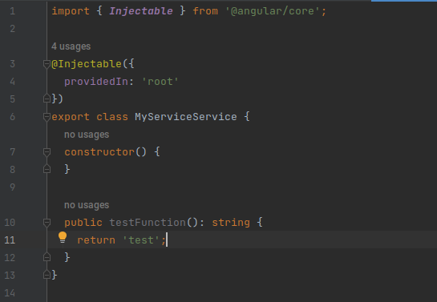
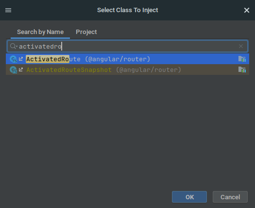
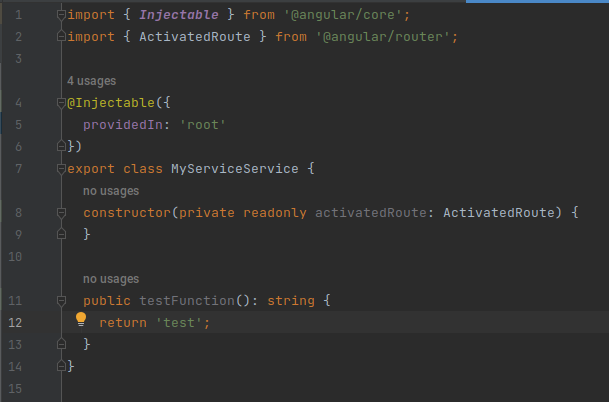

# Intellij Angular Inject Into Plugin

## Template ToDo list
- [x] Create a new [IntelliJ Platform Plugin Template][template] project.
- [ ] Get familiar with the [template documentation][template].
- [ ] Verify the [pluginGroup](/gradle.properties), [plugin ID](/src/main/resources/META-INF/plugin.xml) and [sources package](/src/main/kotlin).
- [ ] Review the [Legal Agreements](https://plugins.jetbrains.com/docs/marketplace/legal-agreements.html).
- [ ] [Publish a plugin manually](https://plugins.jetbrains.com/docs/intellij/publishing-plugin.html?from=IJPluginTemplate) for the first time.
- [ ] Set the Plugin ID in the above README badges.
- [ ] Set the [Deployment Token](https://plugins.jetbrains.com/docs/marketplace/plugin-upload.html).
- [ ] Click the <kbd>Watch</kbd> button on the top of the [IntelliJ Platform Plugin Template][template] to be notified about releases containing new features and fixes.

<!-- Plugin description -->
This plugin adds a single action to the `Tools` menu, `Angular Inject Into`. This action makes it easier to inject
services or other classes into your Angular components, directives, and services. It lets you search and select what you
want to inject, then it automatically adds a private readonly field to the constructor, along with the appropriate
import statement.

The plugin correctly handles files with multiple injection targets (eg, a Component and an NgModule in the same file) by
asking which should be used. It also deals with classes without a constructor to inject into by creating one.

To make everything even easier, add a key binding for the action (I use Ctrl-Shift-2).
<!-- Plugin description end -->

## Installation

- Using IDE built-in plugin system:
  
  <kbd>Settings/Preferences</kbd> > <kbd>Plugins</kbd> > <kbd>Marketplace</kbd> > <kbd>Search for "intellij-angular-inject-into"</kbd> >
  <kbd>Install Plugin</kbd>
  
- Manually:

  Download the [latest release](https://github.com/slak44/intellij-angular-inject-into/releases/latest) and install it manually using
  <kbd>Settings/Preferences</kbd> > <kbd>Plugins</kbd> > <kbd>⚙️</kbd> > <kbd>Install plugin from disk...</kbd>

---
Plugin based on the [IntelliJ Platform Plugin Template][template].

[template]: https://github.com/JetBrains/intellij-platform-plugin-template
